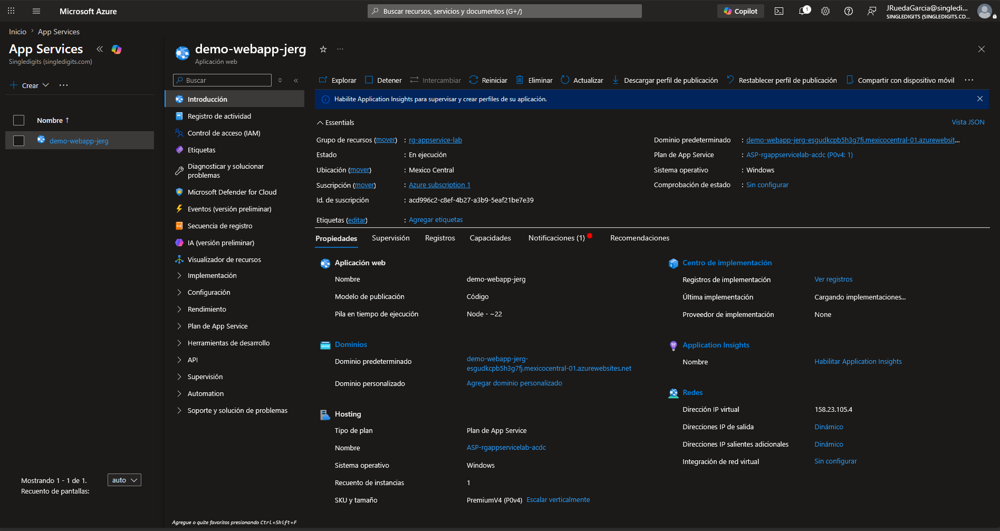
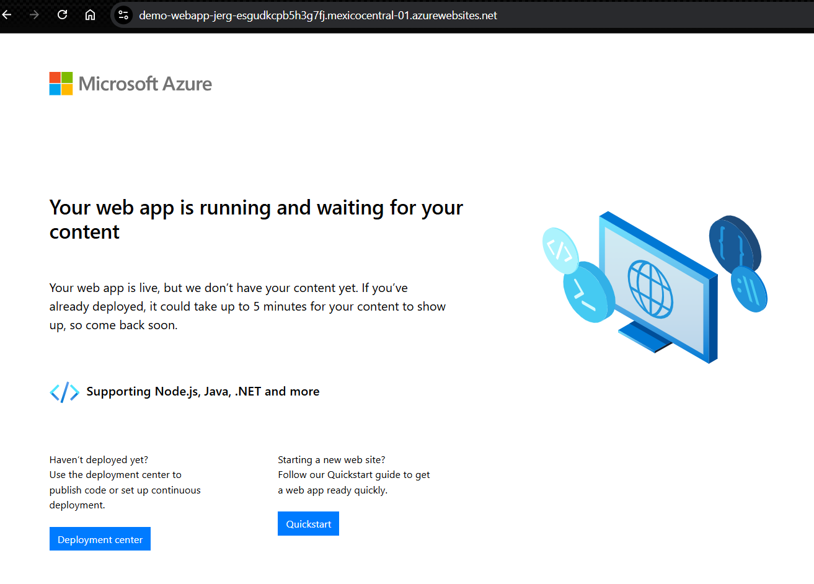
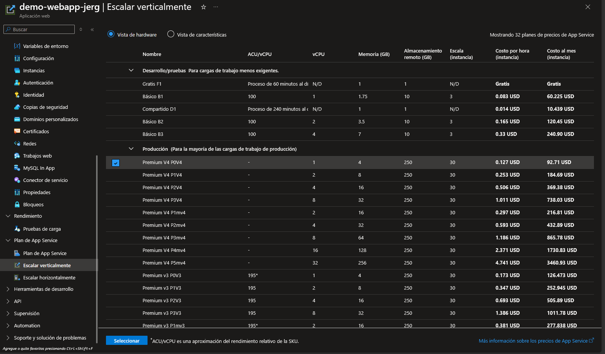
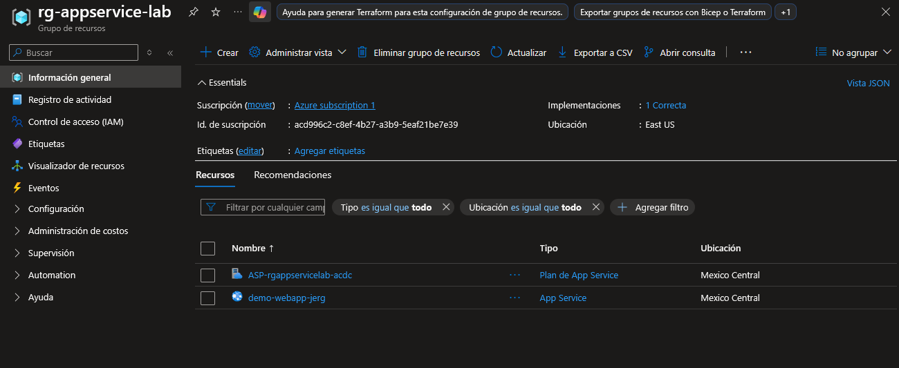

# Laboratorio: Despliegue de App Service en Azure

## Objetivo
Desplegar una aplicación web usando Azure App Services (PaaS) y documentar el proceso como parte del estudio de AZ-900.

## Servicios utilizados
- Azure App Service (Plan Gratis F1)
- Grupo de recursos

## Pasos realizados
1. Creación del grupo de recursos `rg-appservice-lab`.
2. Creación de App Service con runtime Node.js 20 LTS en Windows, región Mexico.
3. Verificación de la URL pública generada automáticamente.
4. Confirmación de que el plan F1 es gratuito y no genera costos.
5. Eliminación de todos los recursos para evitar cargos.

## Evidencia

### App Service creado

### Página web funcionando

### Plan de precios

### Grupo de recursos

## Aprendizajes
- App Services abstrae máquinas virtuales, balanceadores de carga y escalado.
- Con el plan F1 se puede experimentar sin costo.
- La URL se genera automáticamente con el dominio `azurewebsites.net`.
- App Services es PaaS: solo me preocupo por el código, no por la infraestructura.

## Recursos
- [Documentación oficial de App Service](https://learn.microsoft.com/es-es/azure/app-service/)
